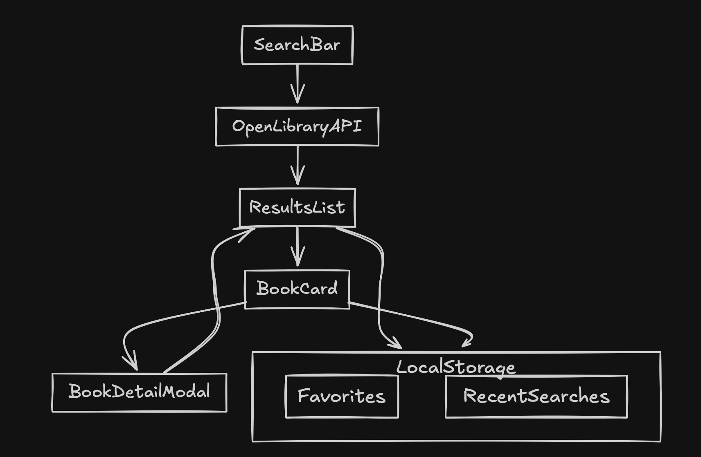

# 📚 Book Finder App

## 👤 User Persona: Alex the College Student
Meet **Alex**, college student juggling classes, assignments, and research projects.  
Alex often needs to:
- Find books quickly for coursework and projects.  
- Search by **title, author, ISBN, or subject** when references are vague.  
- Access **free eBooks** due to budget constraints.  
- Save relevant books for later while studying.  

This app was built to solve Alex’s problem of **finding and managing books efficiently** using the Open Library API.

---

## 🚀 Features

### ✅ Must-have (Core MVP)
- Keyword search (title, author, ISBN).
- Subject/topic search.
- Search results with title, author, year, and cover image.
- Book detail view (description, edition info, subjects).
- Direct “Read/Borrow” link to Open Library.

### 👍 Should-have (Usability & Polish)
- Filter: eBook availability.
- Sort results (relevance, newest first).
- Language filter option.
- Responsive, clean UI with loading/error states.

### 💡 Could-have (Extra Credit)
- Save to **Favorites** (localStorage).
- Recently searched terms/history.
- Recommended books based on subjects.

---

## 🛠️ Tech Stack & Architecture

- **React (Vite/CRA on CodeSandbox)** – fast, component-based UI.
- **Open Library API** – book search & metadata.
- **Tailwind CSS + shadcn/ui** – modern, responsive styling.
- **Framer Motion** (optional) – smooth animations for polish.
- **LocalStorage** – lightweight persistence for Favorites/History.

**Architecture Decisions:**
- Split into **SearchBar**, **ResultsList**, **BookCard**, and **BookDetailModal** components for reusability.
- API logic isolated in a `services/api.js` file for maintainability.
- Filters & sorting handled in state management (React hooks).

### 📊 Architecture Diagram
 

---

## ▶️ How to Run & Test

1. Open the CodeSandbox link: [ https://mgth47.csb.app/ ]  
2. Type a keyword (e.g., “data science”, “Shakespeare”, or an ISBN).  
3. Explore results → click on a book to view details.  
4. Try filters (eBook, sort by date, language) if implemented.  
5. Optionally, add books to Favorites or check your Recent Searches.

---

## 🗺️ Feature Roadmap (3-Day Timeline with MoSCoW)

| Day       | Must-have ✅                                                                 | Should-have 👍                                | Could-have 💡                   |
|-----------|------------------------------------------------------------------------------|-----------------------------------------------|----------------------------------|
| **Day 1** | Search bar (title/author/ISBN), Subject/topic search, Results list with cover/author/year, Book detail modal, Direct Read/Borrow link | –                                             | –                                |
| **Day 2** | –                                                                            | Filter (eBook availability), Sort (date/relevance), Language filter | –                                |
| **Day 3** | –                                                                            | –                                             | Favorites (localStorage), Recently searched terms, Recommended books |

---

## 🔮 Future Roadmap

If given more time, the following features could extend the app’s value for Alex and other students:
- **Citation export** in APA/MLA for academic use.
- **Advanced filters** (publisher, edition, year range).
- **Study group integration** – share books with classmates.
- **AI-powered recommendations** (using embeddings or genre clustering).

---

## ✨ Closing Note

This app demonstrates not just coding ability but also **product thinking**:
- Designed around a clear persona (Alex).  
- Prioritized with MoSCoW for impact within 3 days.  
- Built to be extendable with future enhancements.  

---

## 🤝 How to Contribute

Contributions are welcome! If you’d like to help improve BookFinder:

- Fork the repository  
- Create feature branches for bug fixes or enhancements  
- Submit pull requests with clear descriptions  
- Report issues or suggest features via GitHub Issues  
- Ensure all new code follows the existing coding style

Thank you for helping make BookFinder better!

---

## ⚠️ Known Issues

- Occasional incomplete data from the Open Library API (missing cover images or author names)  
- No advanced pagination; currently limits results to 20 items  
- Limited accessibility testing; keyboard navigation improvements planned  
- No offline support or caching beyond in-memory during session
